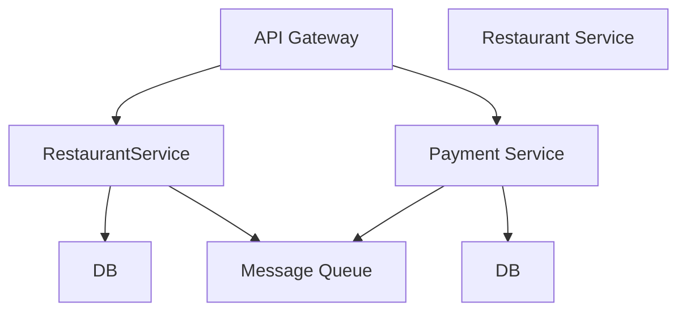

## public projects roadmap

### restaurant management system (backend microservices + restaurant and order management webapp) + kiosk desktop app

#### architecture[the diagram is just for testing]

<!-- 

 

    Mayor[The Mayor AI Coordinator]
    Town[Town Workspace ~/gt/]

    Town --> Mayor
    Town --> Rig1[Rig: Project A]
    Town --> Rig2[Rig: Project B]

    Rig1 --> Crew1[Crew Member Your workspace]
    Rig1 --> Hooks1[Hooks Persistent storage]
    Rig1 --> Polecats1[Polecats Worker agents]

    Rig2 --> Crew2[Crew Member]
    Rig2 --> Hooks2[Hooks]
    Rig2 --> Polecats2[Polecats]

    Hooks1 -.git worktree.-> GitRepo1[Git Repository]
    Hooks2 -.git worktree.-> GitRepo2[Git Repository]

    style Mayor fill:#e1f5ff
    style Town fill:#f0f0f0
    style Rig1 fill:#fff4e1
    style Rig2 fill:#fff4e1
    -->
    
<!-- ### money manager pwa
## digital badge signing and verification platform
## api test automation platform (like postman but nice test visualization and smaller feature set)

🟥 🟧 🟨 🟩 🟦 🟪 🟫 ⬛ ⬜ 

-->
