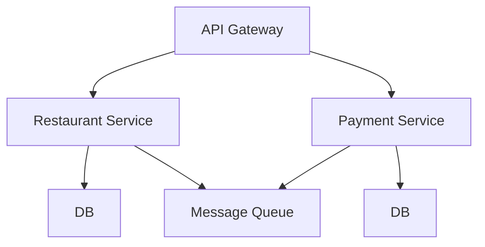

## public projects roadmap

### restaurant management system (backend microservices + restaurant and order management webapp) + kiosk desktop app

#### architecture[the diagram is just for testing]

    
<!-- ### money manager pwa
## digital badge signing and verification platform
## api test automation platform (like postman but nice test visualization and smaller feature set)

🟥 🟧 🟨 🟩 🟦 🟪 🟫 ⬛ ⬜ 

-->
